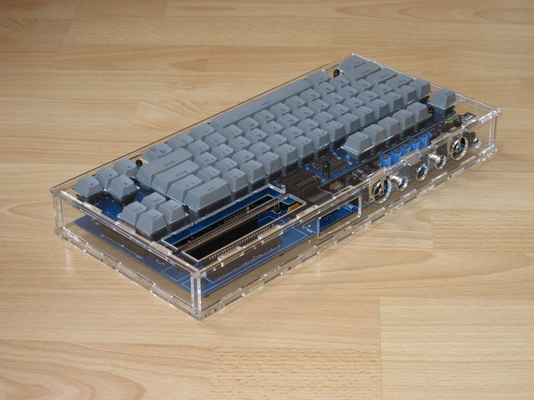

# Chasis del Omega
Caja de acrílico para el Omega Home Computer

[Read this document in English](Enclosure.md)

## Introducción
Esta es una caja de acrílico cortada con laser para el Omega Home Computer.
El diseño presupone que será cortado de una lámina de 3mm de acrílico (o plástico similar)

## Documentación del Hardware

### Instrucciones de montaje

El chasis se ha de ensamblar en el siguiente orden:

1. Se insertan once tonrillos M3 x 12 en los agujeros del panel inferior (cara arriba)
2. Se colocan arandelas de 3 mm en dichos tornillos en la cara superior del panel inferior
3. Se inserta la placa base encima de las arandelas
4. Se enroscan siete separadores M3 x 15 mm por encima de esos tornillos, excluyendo los agujeros proximos a los slots de cartucho
5. Se usan cuatro tuercas M3 hexágonales para asegurar la placa en la zona de los slot, colocando opcionalmente las guias de slot impresas en 3D
6. (Opcional) Se conecta un interruptor al conector de pines en la placa base
7. Se coloca la placa del teclado encima de los separadores. Se asegura utilizando una tuerca M3 bajo la barra espaciadora, y seis separadores M3 x 10 mm en el resto
8. Se colocan cuatro paneles laterales a través de las ranuras en el panel inferior. (Opcional) Se monta el interruptor en el panel posterior
9. Se fija el panel superior sobre los separadores utilizando seis tornillos M3 x 8 mm

### Lista de componentes - Version 1.0

Tipo de componente | Referencia| Descripcion                       | Cantidad | Posible fuente y notas
------------------ | --------- | --------------------------------- | -------- | --------------------------
Separadores        |           | M3 x 10 mm, female, OD: 5 mm hex  | 6        | Mouser [534-24393](https://www.mouser.com/ProductDetail/534-24393)
Separadores        |           | M3 x 15 mm, male/female, OD: 5 mm hex  | 7   | Mouser [534-24315](https://www.mouser.com/ProductDetail/534-24315)
Tornillos          |           | M3 x 12 mm, Flat Socket Cap       | 11       | Fastenal [M42510012A40000](https://www.fastenal.com/products/details/M42510012A40000)
Tornillos          |           | M3 x 8 mm, Flat Socket Cap        | 6        | Fastenal [M42510008A40000](https://www.fastenal.com/products/details/M42510008A40000)
Tuercas            |           | M3 hex                            | 5        | Fastenal [MN2510000A20000](https://www.fastenal.com/products/details/MN2510000A20000)
Panel Acrílico     |           | [Panel inferior](Enclosure/Omega-Eco1_User.dxf) | 1 | corte laser de 3mm en acrilico
Panel Acrílico     |           | [Paneles superior, laterales, arandelas](Enclosure/Omega-Eco2_User.dxf) | 1 | corte laser de 3mm en acrilico
Pieza impresa 3D   |           | [Guia de slots](Enclosure/Omega-Slots_Guide.stl) | 1 | (Opcional) impreso en 3D
Interruptor        |           | Interruptor de palanca                | 1        | (Opcional) Mouser [612-100-A1121](https://www.mouser.com/ProductDetail/612-100-A1121). Se monta este interruptor en el panel posterior, que sirve para seleccionar la BIOS de entre los dos segmentos de la ROM, p.e. para cambiar entre BIOS MSX2 y C-BIOS. Opcionalmente, se puede montar un botón de reset en esa ubicación.

## Notas de la versión

### Cambios
* Version 1.0
  * Versión inicial

### Problemas conocidos

