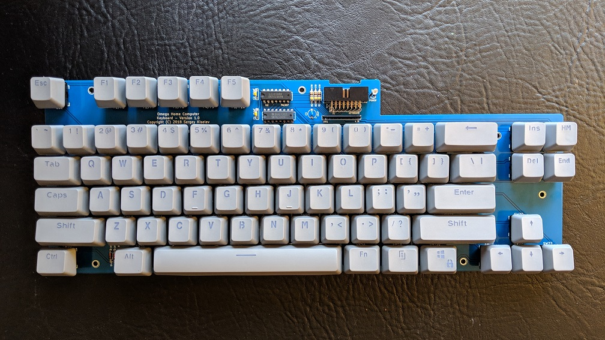

# Teclado del Omega
Teclado para el Ordenador Personal Omega

[Read this document in English](Keyboard.md)

## Introduccion

## Documentación del Hardware 

### Esquemático y Diseño de la PCB

[Schematic - Version 1.1](Keyboard/KiCad/Omega-Keyboard-Schematic-1.1.pdf)

[PCB Layout - Version 1.1](Keyboard/KiCad/Omega-Keyboard-Board-1.1.pdf)

### Conectores

#### J1 - Keyboard Interface
Pin | Description         | Pin | Descripción
--- | ------------------- | --- | ----------------
1   | Salida: Columna 0   | 2   | Power: +5V
3   | Salida: Columna 1   | 4   | Entrada: Fila A
5   | Salida: Columna 2   | 6   | Entrada: Fila B
7   | Salida: Columna 3   | 8   | Entrada: Fila C
9   | Salida: Columna 4   | 10  | Entrada: Fila D
11  | Salida: Columna 5   | 12  | Entrada: Caps Lock LED
13  | Salida: Columna 6   | 14  | Entrada: Kana LED
15  | Salida: Columna 7   | 16  | Power: GND

### Lista de Materiales - Versión 1.0

[Omega Keyboard project on Mouser.com](https://www.mouser.com/ProjectManager/ProjectDetail.aspx?AccessID=716135aec2) - View and order all components except of the keycaps set, and the PCB.

Component type     | Reference | Description                       | Quantity | Possible sources and notes
------------------ | --------- | --------------------------------- | -------- | --------------------------
PCB                |           | Omega Keyboard PCB - Version 1.0  | 1        | Refer to the [RetroBrew Computers Board Inventory](https://retrobrewcomputers.org/doku.php?id=boardinventory) page for ordering information, or order from a PCB manufacturer of your choice using provided Gerber or KiCad files
Integrated Circuit | U1        | 74LS145 Octal D-Type Latch        | 1        | Mouser [595-SN74LS145N](https://www.mouser.com/ProductDetail/595-SN74LS145N)
Integrated Circuit | U2        | 74LS07 Octal Bus Transceiver      | 1        | Mouser [595-SN74LS07N](https://www.mouser.com/ProductDetail/595-SN74LS07N)
LED                | D1        | 3 mm, green LED indicator         | 1        | Mouser [593-VAOL-3HDE4](https://www.mouser.com/ProductDetail/593-VAOL-3HDE4)
LED                | D2        | 3 mm, yellow LED indicator        | 1        | Mouser [593-VAOL-3HCE4](https://www.mouser.com/ProductDetail/593-VAOL-3HCE4)
LED                | D3        | 3 mm, red LED indicator           | 1        | Mouser [593-VAOL-3HAE4](https://www.mouser.com/ProductDetail/593-VAOL-3HAE4)
Diode              | D4-6      | 1N4148                            | 3        | Mouser [512-1N4148TR](https://www.mouser.com/ProductDetail/512-1N4148TR)
Keyboard Switch    | SW1-SW64, SW66-SW73 |  MX Cherry - Linear     | 72       | Mouser [540-MX1A-11NW](https://www.mouser.com/ProductDetail/540-MX1A-11NW)
Keyboard Switch    | SW65      |  MX Cherry - High Force Linear    | 1        | Mouser [540-MX1A-21NW](https://www.mouser.com/ProductDetail/540-MX1A-21NW)
Switch Leveling Kit | SW13, SW49, SW64, SW65, SW73 | Leveling kit for MX 1x2, 1x2.25, 1x2.75 | 5 | Mouser [540-G99-0742](https://www.mouser.com/ProductDetail/540-G99-0742)
Switch Leveling Kit | SW64 | Leveling kit for MX 1x8               | 1        | Mouser [540-G99-0226](https://www.mouser.com/ProductDetail/540-G99-0226) Note: Use one of 540-G99-0742 to build a through hole leveling kit for the spacebar
Keycaps            | SW1-SW73  | 104 Keycaps kit for Cherry MX Keyboard | 1   | Amazon, for example [this one](https://www.amazon.com/Aland-Doubleshot-Spacebar-Mechanical-Keyboard/dp/B07JVL16TD)
Connector          | J1 | 2x8 pin header, right angle, shrouded, 2.54 mm pitch | 1 | Mouser [710-61201621721](https://www.mouser.com/ProductDetail/710-61201621721)
Capacitor          | C1, C2    | 0.1 uF, MLCC, 5 mm lead spacing   | 2       | Mouser [594-K104K15X7RF53H5](https://www.mouser.com/ProductDetail/594-K104K15X7RF53H5)
Capacitor          | C3        | 10 uF, MLCC, 5 mm lead spacing    | 1       | Mouser [810-FG28X5R1E106MR00](https://www.mouser.com/ProductDetail/810-FG28X5R1E106MR00)
Resistor Array     | RN1       | 4.7 kohm, bussed, 6 pin SIP       | 1        | Mouser [264-4.7K-RC](https://www.mouser.com/ProductDetail/264-4.7K-RC)
Resistor           | R1 - R3    | 470 ohm, through hole            | 3        | Mouser [291-470-RC](https://www.mouser.com/ProductDetail/291-470-RC)

## Cambios
* Versión 1.1
  * Renombrar RR1 por RN1
  * Mantener las resistencias pull-ups sólo para las salidas buffer de COLUMNAS. Sustituir RN1 por un array de resistencias SIP de 6-pin
  * Actualizar el esquemático para usar librerías de KiCad más recientes
  * Añadir la URL del proyecto y los logos a la serigrafía
* Version 1.0
  * Versión Inicial

## Problemas Conocidos
* Version 1.0
  * Las resistencias Pull-up no son necesarias en las salidas COLUMNAS del teclado. En su lugar, debería ir en la Placa Base.
