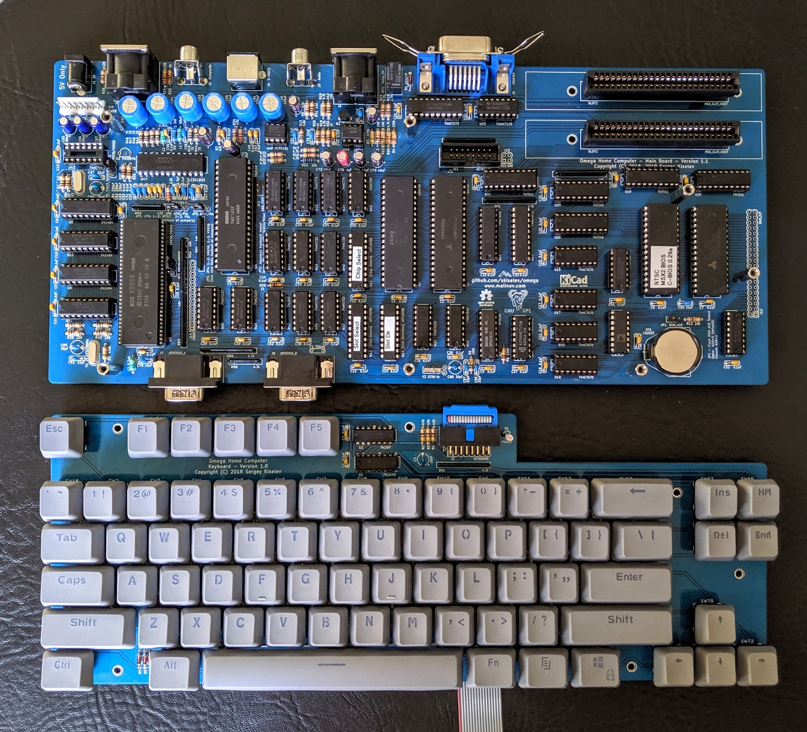

# Omega Placa Base
Placa Base para el Omega Home Computer

[Read this document in English](Mainboard.md)

## Tabla de Contenido
* [Introducción](#introducción)
* [Especificaciones](#especificaciones)
* [Documentación del Hardware](#documentación-del-hardware)
  * [Esquema y diseño de la PCB](#esquema-y-diseño-de-la-pcb)
  * [Conectores](#conectores)
  * [Jumpers](#jumpers)
  * [Lista de componentes](#lista-de-componentes)
  * [Puertos de Entrada y Salida](#puertos-de-entrada-y-salida)
  * [Mapa de Slots](#mapa-de-slots)
* [Documentación del Firmware](#documentación-del-firmware)
  * [BIOS](#bios)
  * [Esquema de fusibles SPLD](#esquema-de-fusibles-spld)
* [Notas de la versión](#notas-de-la-versión)
  * [Cambios](#cambios)
  * [Problemas conocidos](#problemas-conocidos)

## Introducción
La Placa Base tiene implementada la funcionalidad del estándar MSX2*, tal como se describe en la siguiente sección de  [Especificaciones](#especificaciones). La Placa Base está diseñada para ser apilada bajo la placa del teclado para crear la típica forma de "Ordenador teclado" de los ordenadores domésticos de los 80.
 

## Especificaciones
* Procesador: CPU Zilog Z80 (version CMOS - Z84C00) a 3.58 Mhz de reloj
* Memoria:
  * RAM: 512 KiB SRAM, ampliable a 4 MiB usando una placa hija opcional. Paginador de memoria compatible con MSX*. La RAM está mapeada en el slot 3-2
  * ROM: Flash ROM de 256 KiB o 512 KiB. La ROM está mapeada al slot 0 y los sub slots 3-0, 3-1 y 3-3.
* Video: VDP Yamaha V9958 o Yamaha V9938 
  * 128 KiB Video RAM
  * Salidas de video compuesto, S-Video, y RGB
* Audio: PSG Yamaha YM2149 o el AY-3-8910 de General Instruments.
* Dos slots para cartucho compatibles con MSX* 
* Teclado, Joysticks, e Interfaces para la Impresora y el reproductor de Cassette
* RTC: Ricoh RP5C01
* Supervisor del Microprocesador:
  * Generación de Reset
  * Battería de respaldo RTC
* BIOS: [C-BIOS](http://cbios.sourceforge.net/). Compatible con BIOS de ordenadores originales MSX2* con organización de slots y especificaciones de hardware similares como por ejemplo [Sanyo* PHC-23J](https://www.msx.org/wiki/Sanyo_PHC-23J)

## Documentación del Hardware

### Esquema y diseño de la PCB

[Esquematico - Version 1.2](Mainboard/KiCad/Omega-Mainboard-Schematic-1.2.pdf)

[Diseño de la PCB - Version 1.2](Mainboard/KiCad/Omega-Mainboard-Board-1.2.pdf)

### Conectores

#### J1 - Power (5V)
Conecta una fuente de alimentación regulada a +5V a este conector.

Nota: Los componentes de la placa usan solo voltajes de 5V. Algunos cartuchos pueden necesitar 12V/-12V adicionales. El conector J10 debe usarse en este caso

Pin | Descripción     
--- | ---------------
Pin (contacto interno) | Power: 5V (terminal positivo)
Tambor / Pantalla      |	Power: GND (terminal negativo)

#### J2 - Video Compuesto

Pin | Descripción     
--- | ---------------
Pin (contacto interno)| Salida: Video Compuesto
Anillo / Pantalla     |	Power: GND

#### J3 - Audio

Pin | Descripción     
--- | ---------------
Tip (contacto interno)| Salida: Audio (nivel de línea)
Anillo / Pantalla     |	Power: GND

#### J4 - S-Video

Pin | Descripción     
--- | ---------------
1, 2 | Power: GND
3    |	Salida: Luminancia (intensidad)
4    | Salida: Chrominancia (color)

#### J5 - RGB Conector
Pin | Descripción     
--- | ---------------
1   | Power: GND
2   |	Salida: Audio (nivel de línea)
3   |	Salida: AV (4.55V)
4   |	Salida: Video Compuesto
5   |	Salida: YS (3 V)
6   |	Salida: Rojo
7   | Salida: Verde
8   | Salida: Azul

#### J6 - Cassette Conector
Pin | Descripción     
--- | ---------------
1, 2, 3, 8   | Power: GND
4   |	Salida: Salida de audio hacia el grabador de cassette (nivel de microfono)
5   |	Entrada: Entrada de audio desde el grabador de cassette (nivel de línea)
6   |	Salida: Relé - Control de Motor
7   | Salida: Relé - Control de Motor

#### J7, J8 - Conectores de Joystick
Pin | Descripción     
--- | ---------------
1   | Entrada: Avanzar (norte / arriba)
2   | Entrada: Retroceder (sur / abajo)
3   | Entrada: Izquierda (oeste)
4   | Entrada: Derecha (este)
5   | Power: 5V
6   | Entrada: Botón 1
7   | Entrada: Botón 2
8   | Salida: Selección de Joystick
9   | Power: GND (tierra)

#### J9 - Conector de Impresora
Pin | Descripción     
--- | ---------------
1   | Salida: /STROBE (pulso)
2   | Salida: D0
3   | Salida: D1
4   | Salida: D2
5   | Salida: D3
6   | Salida: D4
7   | Salida: D5
8   | Salida: D6
9   | Salida: D7
10  | No conectado
11  | Entrada: BUSY (ocupado)
12  | No conectado
13  | No conectado
14  | Power: GND (tierra)

#### J10 - Power (5V, 12V, -12V)
Conecta una fuente de alimentación regulada 5V/12V/-12V a este conector.

Pin | Descripción     
--- | ---------------
1, 2, 3 | Power: GND
4, 5, 6 |	Power: 5V
7   |	Power: 12V
8   |	Power: -12V

#### J11 - Interfaz de Teclado 
Pin | Descripción     | Pin | Descripción
--- | --------------- | --- | ----------------
1   | Entrada: Columna 0 | 2   | Power: 5V
3   |	Entrada: Columna 1 | 4   | Salida: fila A
5   |	Entrada: Columna 2 | 6   | Salida: fila B
7   |	Entrada: Columna 3 | 8   | Salida: fila C
9   |	Entrada: Columna 4 | 10  | Salida: fila D
11  |	Entrada: Columna 5 | 12  | Salida: Bloq May LED
13  | Entrada: Columna 6 | 14  | Salida: Kana/Code LED
15  | Entrada: Columna 7 | 16  | Power: GND

#### J12 - Extensor SRAM
Pin | Descripción      | Pin | Descripción
--- | ---------------- | --- | ----------------
1   | Power: 5V        | 2   | Power: 5V
3   |	Salida: /RAM2_CS | 4   | Salida: /RAM1_CS
5   |	Salida: /RAM4_CS | 6   | Salida: /RAM3_CS
7   |	Salida: /RAM6_CS | 8   | Salida: /RAM5_CS
9   |	Salida: RAM_A18  | 10  | Salida: /RAM7_CS
11  |	Salida: RAM_A16  | 12  | Salida: RAM_A15 
13  | Salida: RAM_A14  | 14  | Salida: RAM_A17 
15  | Salida: A12      | 16  | Salida: /WR
17  | Salida: A7       | 18  | Salida: A13
19  | Salida: A6       | 20  | Salida: A8
21  | Salida: A5       | 22  | Salida: A9
23  | Salida: A4       | 24  | Salida: A11
25  | Salida: A3       | 26  | Salida: /RD
27  | Salida: A2       | 28  | Salida: A10
29  | Salida: A1       | 30  | Bi-direccional: MD7
31  | Salida: A0       | 32  | Bi-direccional: MD6
33  | Bi-direccional: MD0 | 34  | Bi-direccional: MD5
35  | Bi-direccional: MD1 | 36  | Bi-direccional: MD4
37  | Bi-direccional: MD2 | 38  | Bi-direccional: MD3
39  | Power: GND       | 40  | Power: GND

#### J13 - Conector /RST and /NMI
Pin | Descripción     | Pin | Descripción
--- | --------------  | --- | -----------
1   | In/Out: /RESET  | 2   | Power: GND
3   | Entrada: /NMI   | 4   | Power: GND

#### J14 - Bus de color VDP 
Pin | Descripción
--- | -----------
1   | Power: 5V
2   | Salida: /DHCLK
3   | Salida: /DLCLK
4   | Salida: CBDR
5   | In/Out: CB7
6   | In/Out: CB6
7   | In/Out: CB5
8   | In/Out: CB4
9   | In/Out: CB3
10  | In/Out: CB2
11  | In/Out: CB1
12  | In/Out: CB0
13  | Power: GND

### Jumpers

#### JP1 - ROM_A18
JP1 selecciona la seccion de 256 KiB (mitad inferior o mitad superiro) de la memoria Flash ROM que se mapea como ROM del sistema o slot.

Jumper Position	| Descripción
--------------- | -----------
Abierto*        | selecciona las direcciones 0x00000 - 0x3FFFF del chip ROM
Cerrado         | selecciona las direcciones 0x40000 - 0x7FFFF del chip ROM

#### JP2 - KBD_TYPE
JP2 selecciona la configuración de teclado japonés

Jumper Position | Descripción
--------------- | -----------
Abierto*        | configuración JIS
Cerrado         | configuración ANSI/AIUEO/50on

#### JP3, JP4 - V9938/V9958
JP3 y JP4 seleccionan el tipo de VDP a usar. JP3 conecta el Pin 21 del VDP, bien con una resistencia de 470 ohm (pull-up) (V9938, Salida de video compuesto deshabilitada), o bien a 5V (V9958, alimentación de DAC). JP4 selecciona si la salida CSYNC del VDP va directamente al codificador RGB (V9958) o a un circuito convertidor de nivel (V9938).

*Aviso: Un ajuste erroneo del JP3 dañará el VDP*

Posición del Jumper | Descripción
------------------- | -----------
1-2                 | V9938 VDP
2-3                 | V9958 VDP

#### JP5, JP6 - NTSC/PAL
Los Jumpers JP5 y JP6 seleccionan el sistema codificacior de color para la salida de Video. Para ser más específicos, el JP5 configura el codificador RGB y el JP6 selecciona la frecuencia sub-portadora de color.

*Nota: Algunos componentes se usan solamente para generar la frecuencia sub-portadora del sistema PAL y pueden ser omitidos si se usa el codificador NTSC. Mira la Lista de componentes para más información*

Posición del Jumper| Descripción
------------------ | -----------
1-2                | NTSC
2-3                | PAL

### Lista de Componentes

[Proyecto de Placa Base para Omega en Mouser.com](https://www.mouser.com/ProjectManager/ProjectDetail.aspx?AccessID=11fd34d22c) - Puedes ver y encargar todos los componentes exceptuando la PCB, El Yamaha VDP V9958, el Ricoh RTC RP5C01, La DRAM NEC D41464, el Codificador RGB Sony CXA1645P y la pila CR2032.

Component type     | Reference | Description                                 | Quantity | Possible sources and notes
------------------ | --------- | ------------------------------------------- | -------- | --------------------------
PCB                |           | PCB Omega Placa Base - Version 1.1          | 1        | dirigirse a [RetroBrew Computers Board Inventory](https://retrobrewcomputers.org/doku.php?id=boardinventory) para instrucciones de pedido, o pedir al fabricante PCB de tu elección usando los Gerber proveidos o los ficheros de KiCad.
Circuito Integrado | U1        | Z80 CPU, CMOS, 40 pin DIP - Z84C00xxPEG     | 1        | Mouser [692-Z84C0010PEG](https://www.mouser.com/ProductDetail/692-Z84C0010PEG)
Circuito Integrado | U2        | 82C55 PPI, CMOS, 40 pin DIP - CP82C55AZ     | 1        | Mouser [968-CP82C55A-5Z](https://www.mouser.com/ProductDetail/968-CP82C55A-5Z)
Circuito Integrado | U3        | V9958 VDP, 64 pin DIP                       | 1        | eBay. Nota: V9938 VDP puede ser utilizada en su lugar
Circuito Integrado | U4        | YM2149 PSG, 40 pin DIP or AY-3-8910         | 1        | eBay
Circuito Integrado | U5        | RP5C01 RTC, 18 pin DIP                      | 1        | eBay
Circuito Integrado | U6        | 512 KiB Flash ROM, 32 pin DIP - SST39SF040  | 1        | Mouser [804-39SF0407CPHE](https://www.mouser.com/ProductDetail/804-39SF0407CPHE)
Circuito Integrado | U7        | 512 KiB SRAM, 32 pin DIP - AS6C4008         | 1        | Mouser [913-AS6C4008-55PCN](https://www.mouser.com/ProductDetail/913-AS6C4008-55PCN)
Circuito Integrado | U8 - U11  | D41464, 64K x 4 DRAM, 18 pin DIP            | 4        | eBay
Circuito Integrado | U12 - U14 | Simple Programmable Logic Device - ATF16V8B | 3        | Mouser [556-AF16V8B15PU](https://www.mouser.com/ProductDetail/556-AF16V8B15PU)
Circuito Integrado | U15 - U18 | 4-by-4 Register File - 74HC670, 16 pin DIP  | 4        | Mouser [595-CD74HC670E](https://www.mouser.com/ProductDetail/595-CD74HC670E)
Circuito Integrado | U19 - U21 | 74F541, 20 pin DIP                          | 3        | Mouser [595-SN74F541N](https://www.mouser.com/ProductDetail/595-SN74F541N)
Circuito Integrado | U22       | 74HCT540, 20 pin DIP                        | 1        | Mouser [595-SN74HCT540N](https://www.mouser.com/ProductDetail/595-SN74HCT540N)
Circuito Integrado | U23, U24  | 74HCT273, 20 pin DIP                        | 2        | Mouser [595-SN74HCT273N](https://www.mouser.com/ProductDetail/595-SN74HCT273N). Nota U24 es opcional - soporte a puerto impresora.
Circuito Integrado | U25, U26  | 74F245, 20 pin DIP                          | 2        | Mouser [595-SN74F245N](https://www.mouser.com/ProductDetail/595-SN74F245N)
Circuito Integrado | U27       | 74HCT175, 16 pin DIP                        | 1        | Mouser [595-CD74HCT175E](https://www.mouser.com/ProductDetail/595-CD74HCT175E)
Circuito Integrado | U28, U29  | 74HCT157, 16 pin DIP                        | 2        | Mouser [595-SN74HCT157N](https://www.mouser.com/ProductDetail/595-SN74HCT157N)
Circuito Integrado | U30, U31  | 74HCT153, 16 pin DIP                        | 2        | Mouser [595-CD74HCT153E](https://www.mouser.com/ProductDetail/595-CD74HCT153E)
Circuito Integrado | U32       | 74AHCT138, 16 pin DIP                       | 1        | Mouser [595-SN74AHCT138N](https://www.mouser.com/ProductDetail/595-SN74AHCT138N)
Circuito Integrado | U33       | 74AHCT125, 14 pin DIP                       | 1        | Mouser [595-SN74AHCT125N](https://www.mouser.com/ProductDetail/595-SN74AHCT125N). Nota U33 es opcional - soporte a puerto impresora.
Circuito Integrado | U34 - U36 | Dual Flip Flop - 74HCT74, 14 pin DIP        | 3        | Mouser [595-SN74HCT74N](https://www.mouser.com/ProductDetail/595-SN74HCT74N)
Circuito Integrado | U37 - U39 | 74AHCT32, 14 pin DIP                        | 3        | Mouser [595-SN74AHCT32N](https://www.mouser.com/ProductDetail/595-SN74AHCT32N)
Circuito Integrado | U40, U41  | 74HCT30, 14 pin DIP                         | 2        | Mouser [595-CD74HCT30E](https://www.mouser.com/ProductDetail/595-CD74HCT30E)
Circuito Integrado | U42       | 74LS07, 14 pin DIP                          | 1        | Mouser [595-SN74LS07N](https://www.mouser.com/ProductDetail/595-SN74LS07N)
Circuito Integrado | U43       | 74HCT04, 14 pin DIP                         | 1        | Mouser [595-SN74HCT04N](https://www.mouser.com/ProductDetail/595-SN74HCT04N)
Circuito Integrado | U44       | 74AHCT02, 14 pin DIP                        | 1        | Mouser [595-SN74AHCT02N](https://www.mouser.com/ProductDetail/595-SN74AHCT02N)
Circuito Integrado | U45       | 74HCT00, 14 pin DIP                         | 1        | Mouser [595-SN74HCT00N](https://www.mouser.com/ProductDetail/595-SN74HCT00N)
Circuito Integrado | U46       | Microprocessor Supervisory Circuit - ADM691A | 1        | Mouser [584-ADM691AANZ](https://www.mouser.com/ProductDetail/584-ADM691AANZ); Alternativas válidas: MAX691, LTC691, ADM691
Circuito Integrado | U47       | Sony CXA1645P RGB Encoder, 24 pin DIP-400   | 1        | eBay
Circuito Integrado | U48       | MCP6281-E/P Operational Amplifier, 8 pin DIP | 1       | Mouser [579-MCP6281-E-P](https://www.mouser.com/ProductDetail/579-MCP6281-E-P)
Circuito Integrado | U49       | LM311N, Voltage Comparator, 8 pin DIP       | 1        | Mouser [926-LM311N-NOPB](https://www.mouser.com/ProductDetail/926-LM311N-NOPB). Nota U49 es opcional - soporte grabador cassette.
Condensador        | C1 - C58  | 0.1 uF, MLCC, 5 mm Pitch                    | 58       | Mouser [594-K104K15X7RF53H5](https://www.mouser.com/ProductDetail/594-K104K15X7RF53H5)
Condensador        | C59 - C64 | 220 uF, Electrolitico                       | 6        | Mouser [647-UBW1E221MPD](https://www.mouser.com/ProductDetail/647-UBW1E221MPD). Nota C62 - C64 opcional - soporte salida RGB
Condensador        | C65 - C67 | 100 uF, 16V, Polimero organico de aluminio  | 3        | Mouser [80-A750EK107M1CAAE18](https://www.mouser.com/ProductDetail/80-A750EK107M1CAAE18)
Condensador        | C68 - C70 | 10 uF, MLCC, 5 mm Pitch                     | 3        | Mouser [810-FG28X5R1E106MR00](https://www.mouser.com/ProductDetail/810-FG28X5R1E106MR00). Nota C71 opcional - soporte grabador cassette.
Condensador        | C71 - C77 | 10 uF, Electrolytic                         | 7        | Mouser [647-UPW1E100MDD1TD](https://www.mouser.com/ProductDetail/647-UPW1E100MDD1TD). Nota C71 opcional - soporte grabador cassette.
Condensador        | C78       | 1 uF, Electrolytic                          | 1        | Mouser [710-860020672005](https://www.mouser.com/ProductDetail/710-860020672005). Nota C78 opcional - soporte grabador cassette.
Condensador        | C79, C80  | 22 nF, MLCC, 5 mm Pitch                     | 2        | Mouser [810-FG28X7R1H223KNT0](https://www.mouser.com/ProductDetail/810-FG28X7R1H223KNT0). Nota C79, C80 opcional - soporte grabador cassette.
Condensador        | C81       | 1.5 nF, MLCC, 5 mm Pitch                    | 1        | Mouser [810-FG28C0G1H152JNT0](https://www.mouser.com/ProductDetail/810-FG28C0G1H152JNT0)
Condensador        | C82 - C84 | 330 pF, MLCC, 5 mm Pitch                    | 3        | Mouser [810-FG28C0G1H331JNT0](https://www.mouser.com/ProductDetail/810-FG28C0G1H331JNT0)
Condensador        | C85       | 47 pF, MLCC, 5 mm Pitch                     | 1        | Mouser [810-FG28C0G1H470JNT0](https://www.mouser.com/ProductDetail/810-FG28C0G1H470JNT0)
Condensador        | C86, C87  | 33 pF, MLCC, 5 mm Pitch                     | 2        | Mouser [810-FG28C0G1H330JNT0](https://www.mouser.com/ProductDetail/810-FG28C0G1H330JNT0)
Condensador        | C88 - C90 | 30 pF, Trim Capactiors, 5 mm Pitch          | 3        | Mouser [659-GKG30015](https://www.mouser.com/ProductDetail/659-GKG30015). Nota: Puede ser reemplazado por Mouser [810-FG28C0G2A270JNT0](https://www.mouser.com/ProductDetail/810-FG28C0G2A270JNT0) si no es necesario ajustar la frecuencia portadora de color. DigiKey [2447-GKG30015-ND](https://www.digikey.es/es/products/detail/ew-electronics/GKG30015/11689271) (Mouser ya no los tiene en stock).
Condensador        | C91       | 27 pF, MLCC, 5 mm Pitch                     | 1        | Mouser [810-FG28C0G2A270JNT0](https://www.mouser.com/ProductDetail/810-FG28C0G2A270JNT0). Nota C91 debe ser de 18 pF para soporte PAL.
Condensador        | C92, C93  | 22 pF, MLCC, 5 mm Pitch                     | 2        | Mouser [810-FG28C0G1H220JNT0](https://www.mouser.com/ProductDetail/810-FG28C0G1H220JNT0)
Condensador        | C94       | 4.7 pF, MLCC, 5 mm Pitch                    | 1        | Mouser [810-FG28C0G1H4R7CNT0](https://www.mouser.com/ProductDetail/810-FG28C0G1H4R7CNT0)
Matriz Resistencias| RR1 - RR4 | 10 kohm, en bus, 10 pin SIP                 | 4        | Mouser [652-4610X-1LF-10K](https://www.mouser.com/ProductDetail/652-4610X-1LF-10K) o Mouser [652-4610X-AP1-103LF](https://www.mouser.com/ProductDetail/652-4610X-AP1-103LF)
Matriz Resistencias| RR5 - RR7  | 4.7 kohm, en bus, 10 pin SIP               | 3        | Mouser [652-4610X-1LF-4.7K](https://www.mouser.com/ProductDetail/4610X-101-472LF) o Mouser [652-4610X-AP1-472LF](https://www.mouser.com/ProductDetail/652-4610X-AP1-472LF)
Matriz Resistencias| RR8       | 4.7 kohm, en bus, 6 pin SIP                 | 1        | Mouser [652-4606X-1LF-4.7K](https://www.mouser.com/ProductDetail/652-4606X-1LF-4.7K) o Mouser [652-4606X-AP1-472LF](https://www.mouser.com/ProductDetail/652-4606X-AP1-472LF)
Matriz Resistencias| RR9       | 470 ohm, en bus, 6 pin SIP                  | 1        | Mouser [652-4606X-1LF-470](https://www.mouser.com/ProductDetail/652-4606X-1LF-470) o Mouser [652-4606X-AP1-471LF](https://www.mouser.com/ProductDetail/652-4606X-AP1-471LF)
Resistencia        | R1        | 1 Mohm, axial                               | 1        | Mouser [603-MFR-25FBF52-1M](https://www.mouser.com/ProductDetail/603-MFR-25FBF52-1M). Nota R1 is opcional - soporte PAL.
Resistencia        | R2, R3    | 470 kohm, axial                             | 2        | Mouser [603-MFR-25FBF52-470K](https://www.mouser.com/ProductDetail/603-MFR-25FBF52-470K)
Resistencia        | R4        | 220 kohm, axial                             | 1        | Mouser [603-MFR-25FBF52-220K](https://www.mouser.com/ProductDetail/603-MFR-25FBF52-220K)
Resistencia        | R5, R6    | 100 kohm, axial                             | 2        | Mouser [603-MFR-25FBF52-100K](https://www.mouser.com/ProductDetail/603-MFR-25FBF52-100K)
Resistencia        | R7, R8    | 47 kohm, axial                              | 2        | Mouser [603-MFR-25FBF52-47K](https://www.mouser.com/ProductDetail/603-MFR-25FBF52-47K)
Resistencia        | R9, R10   | 20 kohm, 1% tolerancia, axial               | 2        | Mouser [603-MFR-25FBF52-20K](https://www.mouser.com/ProductDetail/603-MFR-25FBF52-20K). Nota R9 debe ser 16 kohm, 1% para soporte PAL.
Resistencia        | R11 - R14 | 10 kohm, axial                              | 4        | Mouser [603-MFR-25FBF52-10K](https://www.mouser.com/ProductDetail/603-MFR-25FBF52-10K). Nota R11, R12 son opcionales - soporte grabador cassette.  Nota R14 es opcional - soporte salida RGB.
Resistencia        | R15       | 5.6 kohm, axial                             | 1        | Mouser [603-MFR-25FBF52-5K6](https://www.mouser.com/ProductDetail/603-MFR-25FBF52-5K6)
Resistencia        | R16 - R22 | 4.7 kohm, axial                             | 7        | Mouser [603-MFR-25FBF52-4K7](https://www.mouser.com/ProductDetail/603-MFR-25FBF52-4K7). Note R18 - R20 son opcionales - soporte grabador cassette.
Resistencia        | R23, R24  | 2.7 kohm, axial                             | 2        | Mouser [603-MFR-25FBF52-2K7](https://www.mouser.com/ProductDetail/603-MFR-25FBF52-2K7). Note R23, R24 son opcionales - soporte grabador cassette.
Resistencia        | R25, R26  | 2.2 kohm, axial                             | 2        | Mouser [603-MFR-25FBF52-2K2](https://www.mouser.com/ProductDetail/603-MFR-25FBF52-2K2)
Resistencia        | R27 - R33 | 1 kohm, axial                               | 7        | Mouser [603-MFR-25FBF52-1K](https://www.mouser.com/ProductDetail/603-MFR-25FBF52-1K). Nota R31, R32 son opcionales - soporte grabador cassette. Nota R33 es opcional - soporte salida RGB.
Resistencia        | R34       | 470 ohm, axial                              | 1        | Mouser [603-MFR-25FBF52-470R](https://www.mouser.com/ProductDetail/603-MFR-25FBF52-470R) 
Resistencia        | R35       | 180 ohm, axial                              | 1        | Mouser [603-MFR-25FBF52-180R](https://www.mouser.com/ProductDetail/603-MFR-25FBF52-180R). Nota R35 es opcional - soporte salida RGB.
Resistencia        | R36       | 120 ohm, axial                              | 1        | Mouser [603-MFR-25FBF52-120R](https://www.mouser.com/ProductDetail/603-MFR-25FBF52-120R). Nota R36 es opcional - soporte salida RGB.
Resistencia        | R37 - R42 | 100 ohm, axial                              | 6        | Mouser [603-MFR-25FBF52-100R](https://www.mouser.com/ProductDetail/603-MFR-25FBF52-100R). Nota R42 es opcional - soporte grabador cassette.
Resistencia        | R43 - R48 | 75 ohm, axial                               | 6        | Mouser [603-MFR-25FBF52-75R](https://www.mouser.com/ProductDetail/603-MFR-25FBF52-75R). Nota R46 - R48 opcional - soporte salida RGB.
Rele               | RY1       | 5V SPDT rele                                | 1        | Mouser [653-G5V-1-DC5](https://www.mouser.com/ProductDetail/653-G5V-1-DC5) o Mouser [653-G5V-1-T90-DC5](https://www.mouser.com/ProductDetail/653-G5V-1-T90-DC5)
Inductor           | L1        | 68 uH, axial                                | 1        | Mouser [542-78F680-RC](https://www.mouser.com/ProductDetail/542-78F680-RC)
Inductor           | L2, L3    | 5.7 uH, axial                               | 2        | Mouser [542-78F5R6J-RC](https://www.mouser.com/ProductDetail/542-78F5R6J-RC)
Diodo              | D1        | 1N4148                                      | 1        | Mouser [512-1N4148TR](https://www.mouser.com/ProductDetail/512-1N4148TR). Nota D1 es opcional - soporte grabador cassette.
Transistor         | Q1, Q2    | PN2907A                                     | 2        | Mouser [512-PN2907ATF](https://www.mouser.com/ProductDetail/512-PN2907ATF). Nota Q1 es opcional - soporte grabador cassette.
Cristal            | Y1        | 21.477270 MHz                               | 1        | Mouser [695-HC49US-214-U](https://www.mouser.com/ProductDetail/695-HC49US-214-U)
Cristal            | Y2        | 32768 Hz                                    | 1        | Mouser [815-AB38T-32.768KHZ](https://www.mouser.com/ProductDetail/815-AB38T-32.768KHZ)
Cristal            | Y3        | 4.433618 MHz                                | 1        | Mouser [520-HCU443-20X](https://www.mouser.com/ProductDetail/520-HCU443-20X). Nota Y3 es opcional - soporte PAL.
Fusible            | F1        | 750 mA, radial, 5 mm pitch                  | 1        | Mouser [650-RUSBF075-2](https://www.mouser.com/ProductDetail/650-RUSBF075-2)
Conector           | J1        | DC Power Jack, 2mm                          | 1        | Mouser [806-KLDX-0202-A](https://www.mouser.com/ProductDetail/806-KLDX-0202-A)
Conector           | J2        | conector RCA Phono, Amarillo                | 1        | Mouser [490-RCJ-014](https://www.mouser.com/ProductDetail/490-RCJ-014)
Conector           | J2        | conector RCA Phono, Blanco                  | 1        | Mouser [490-RCJ-013](https://www.mouser.com/ProductDetail/490-RCJ-013)
Conector           | J4        | Mini DIN 4-pos, angulo recto, montaje PCB   | 1        | Mouser [490-MD-40SM](https://www.mouser.com/ProductDetail/490-MD-40SM)
Conector           | J5, J6    | DIN 8-pos, angulo recto, montaje PCB        | 2        | Mouser [490-SDF-80J](https://www.mouser.com/ProductDetail/490-SDF-80J). Nota J5 es opcional - soporte RGB; J6 es opcional - soporte grabador cassette.
Conector           | J7, J8    | Sub-D DE9M, angulo recto, montaje PCB       | 2        | Mouser [523-L717SDE09P1ACH3R](https://www.mouser.com/ProductDetail/523-L717SDE09P1ACH3R)
Conector           | J9        | Micro Ribbon 14-pos, hembra, ang. recto, montaje PCB | 1        | Mouser [636-112-014-213R001](https://www.mouser.com/ProductDetail/636-112-014-213R001). Nota J9 es opcional - soporte puerto impresora.
Conector           | J10       | 8 pin conector bloqueo anclaje              | 1        | Mouser [571-6404568](https://www.mouser.com/ProductDetail/571-6404568)
Conector           | J11       | 2x8 pin header, shrouded                    | 1        | Mouser [710-61201621621](https://www.mouser.com/ProductDetail/710-61201621621)
Conector           | J12       | 2x20 pin zocalo                             | 1        | Mouser [517-929852-01-20-RB](https://www.mouser.com/ProductDetail/517-929852-01-20-RB)
Conector           | J13       | 2x2 pin header                              | 1        | Nota: Opcional /RESET y /NMI header
Conector           | J14       | 1x13 pin header                             | 1        | Note: Opcional conector Bus Color
Conector           | SLOT1, SLOT2 | conector 50 pin borde de tarjeta         | 2        | Mouser [571-5530843-5](https://www.mouser.com/ProductDetail/571-5530843-5)
Jumper             | JP1, JP2  | 2 pin header                                | 2        | Mouser [649-78229-102HLF](https://www.mouser.com/ProductDetail/649-78229-102HLF)
Jumper             | JP3 - JP6 | Wire link                                   | 4        | conexión por cable (puente)
Zocalo Bateria     | BT1       | Zocalo Bateria CR2032                       | 1        | Mouser [122-2420-GR](https://www.mouser.com/ProductDetail/122-2420-GR)
Bateria            | BT1       | CR2032 Batteria                             | 1        | Mouser [614-CR2032-200](https://www.mouser.com/ProductDetail/614-CR2032-200), [658-CR2032](https://www.mouser.com/ProductDetail/658-CR2032). Nota: No incluido en el projecto de Mouser Project debido a restricciones de envío.
Zocalo CI          | U1, U2, U4 | 40 pin DIP                                 | 3        | Mouser [517-4840-6000-CP](https://www.mouser.com/ProductDetail/517-4840-6000-CP)
Zocalo CI          | U3        | 64 pin DIP                                  | 1        | eBay
Zocalo CI          | U3        | 64 pin DIP (alternativa)                    | 1        | DigiKey [117-87-764-41-005101](https://www.digikey.es/es/products/detail/preci-dip/117-87-764-41-005101/3757318)
Zocalo CI          | U6, U7    | 32 pin DIP                                  | 2        | Mouser [517-4832-6000-CP](https://www.mouser.com/ProductDetail/517-4832-6000-CP)
Zocalo CI          | U47       | 24 pin DIP, 400 mil spacing                 | 1        | Mouser [517-4824-6000-CP](https://www.mouser.com/ProductDetail/517-4824-6000-CP) or [517-4824-3000-CP](https://www.mouser.com/ProductDetail/517-4824-3000-CP). Nota: Cortar el zocalo por la mitad. Si se usa un zócalo de tamaño 0.600", recortar el sobrante. Como alternativa soldar U47 (CXA1645P) sin zócalo.
Zocalo CI          | U47       | 24 pin DIP, 400 mil spacing (alternativa)   | 1        | DigiKey [110-93-424-41-001000](https://www.digikey.es/es/products/detail/mill-max-manufacturing-corp/110-93-424-41-001000/81797)
Zocalo CI          | U12 - U14, U19 - U26 | 20 pin DIP                       | 11       | Mouser [517-4820-3000-CP](https://www.mouser.com/ProductDetail/517-4820-3000-CP)
Zocalo CI          | U5, U8 - U11 | 18 pin DIP                               | 5        | Mouser [517-4818-3000-CP](https://www.mouser.com/ProductDetail/517-4818-3000-CP)
Zocalo CI          | U15 - U18, U27 - U32, U46 | 16 pin DIP                  | 11       | Mouser [517-4816-3000-CP](https://www.mouser.com/ProductDetail/517-4816-3000-CP)
Zocalo CI          | U33 - U45 | 14 pin DIP                                  | 13       | Mouser [517-4814-3000-CP](https://www.mouser.com/ProductDetail/517-4814-3000-CP)
Zocalo CI          | U48, U49  | 8 pin DIP                                   | 2        | Mouser [517-4808-3000-CP](https://www.mouser.com/ProductDetail/517-4808-3000-CP)

### Opciones de Configuración y Notas sobre la sustitución de Componentes

#### Soporte del Estándar de Video NTSC
La Placa Base del Omega puede ser configurada para funcionar tanto con el estándar de video NTSC (60 Hz) como con PAL (50 Hz). Para hacer funcionar el estándar NTSC la placa debe ser configurada como sigue: 

* No inserte los siguientes componentes (sólo son necesarios para la configuración PAL)
  * Oscilador de Cristal de Cuarzo: Y3
  * Condensadores: C43, C90, C93
  * Resistencias: R1, R30 
  * Circuito Integrado: U43
  * Nota: C43 y U43 también se usan para el convertidor de nivel CSYNC del VDP V9938. Deberan ser instalados en caso de utilizar este.
* Suelde un cable que una JP5 y JP6 en la posición 1-2 para fijar la configuración en NTSC estándar.

#### Soporte del Estándar de Video PAL
Para utilizar el estándar PAL la configuración debe ser como sigue:
* Inserte los siguientes componentes:
  * Oscilador de Cristal de Cuarzo: Y3
  * Condensadores: C43, C90, C93
  * Resistencias: R1, R30
  * Circuito Integrado: U43
* Reemplaze los siguientes componentes:
  * R9 use una resistencia de 16 kohm (en lugar de 20 kohm)
  * C91 use un condensador de 18 pF (en lugar de 27 pF)
* Suelde un cable que una JP5 y JP6 en la posición 2-3 para fijar la configuración en PAL estándar.

### Soporte para VDP V9958
La Placa Base del Omega puede ser configurada para funcionar tanto con el VDP V9958 (recomendado) como con el  V9938. Para hacerlo funcionar con el V9958 la configuración la siguiente: 
* No instale los siguientes componentes:
  * Transistor: Q2
  * Condensador: C43
  * Circuito Integrado: U43
  * Nota: C43 y U43 también se usan para el generador de reloj PAL (clock). Deberá instalarlo si pretende utilizar el estándar de video PAL.
* Suelde un cable que una JP3 y JP4 en la posición 2-3 para el VDP V9958.

### Soporte para VDP V9938
Para hacerlo funcionar con el VDP V9938 la configuración debe ser de la siguiente manera: 
* Inserte los siguientes componentes:
  * Transistor: Q2
  * Condensador: C43
  * Circuito Integrado: U43
* Suelde un cable que una JP3 y JP4 en la posición 1-2 para VDP V9958
* *Aviso: Una configuración erronea del JP3 dañará el VDP*
  
### Puertos de entrada y salida

* 0x90 - 0x91 (alias 0x92 - 0x93) - Puerto de Impresora
  * 0x90: Escritura: Pulso (Strobe) (Bit 0)
  * 0x90: Lectura: Ocupado (Busy) (Bit 1)
  * 0x91: Escritura: Dato
* 0x98 - 0x9B - V9938 Video Display Processor (VDP)
  * 0x98: Lectura/Escritura: Dato de VRAM
  * 0x99: Escritura: Selecctor de registro/Dirección VRAM
  * 0x99: Lectura: Registro de estado
  * 0x9A: Acceso paleta
  * 0x9B: Registro de Acceso Indirecto
* 0xA0 - 0xA2 - YM2149 Generador de sonido programable (PSG)
  * 0xA0: Escritura: Selector de registro
  * 0xA1: Escritura: Valor del registro (dato)
  * 0xA2: Lectura: Valor del registro (dato)
* 0xA8 - 0xAB - 8255 Interfaz parallelo programable (PPI)
  * 0xA8: i8255: Puerto A - Registro de selección de slot primario
  * 0xA9: i8255: Puerto B - Registro de entrada, fila de la matriz de teclado
  * 0xAA: i8255: Puerto C - Registro de salida, columna de la matriz de teclado e interfaz de cassette
  * 0xAB: i8255: Registro de commandos
* 0xB4 - 0xB5 (alias 0xB6 - 0xB7) - RP5C01 Reloj en tiempo real (RTC)
  * 0xB4: RTC: Escritura: Selector de registro
  * 0xB5: RTC: Lectura/Escritura: dato de RTC
* 0xFC - 0xFF - Selector de pagina de memoria
  * 0xFC: Lectura/Escritura: Pagina 0
  * 0xFD: Lectura/Escritura: Pagina 1
  * 0xFE: Lectura/Escritura: Pagina 2
  * 0xFF: Lectura/Escritura: Pagina 3
* 0xFFFF (Memory I/O, slot 3) - Registro selector de sub slot

### Mapa de Slots
* Slot 0
  * 0x0000 - 0x7FFF (32 KiB): ROM principal, mapeada a la ROM 0x00000 - 0x07FFF
  * 0x8000 - 0xBFFF (16 KiB): ROM Logo, mapeada a la ROM 0x08000 - 0x0BFFF
  * 0xC000 - 0xFFFF (16 KiB): Sin uso
* Slot 1: Slot de cartucho 1
* Slot 2: Slot de cartucho 2
* Slot 3: Slot expandido
* Slot 3, Sub slot 0
  * 0x0000 - 0x3FFF (16 KiB): Sub ROM, mapeado a la ROM 0x10000 - 0x13FFF
* Slot 3, Sub slot 1
  * 0x0000 - 0xFFFF (64 KiB): ROM de usuario #1, mapeada a la ROM 0x20000 - 0x2FFFF
* Slot 3, Sub slot 2
  * 0x0000 - 0xFFFF (64 KiB): RAM principal (mapeador de memoria)
* Slot 3, Sub slot 3
  * 0x0000 - 0xFFFF (64 KiB): ROM de usuario #2, mapeada a la ROM 0x30000 - 0x3FFFF

## Documentación del Firmware

### BIOS

El Omega funciona con [C-BIOS](https://sourceforge.net/projects/cbios/) - una BIOS open source para ordenadores MSX.
También puede funcionar con BIOS MSX2* originales de ordenadores con organización de slot y especificaciones hardware similares como por ejemplo el [Sanyo* PHC-23J](https://www.msx.org/wiki/Sanyo_PHC-23J) y el [Philips* NMS 8250](https://www.msx.org/wiki/Philips_NMS_8250). 

### Esquema de fusibles SPLD
El Omega usa tres SPLDs ATF16V8/GAL16V8 (U12 - U14) para decodificación de direcciones y otras lógicas varias. Los esquemas de fusibles SPLD (ficheros JED) están disponibles en la carpeta [Mainboard/SPLD](Mainboard/SPLD) de este repositorio. Los SPLDs son implementados usando tecnología Flash/EEPROM y pueden ser programados con los programadores de EEPROM disponibles habitualmente tales como el MiniPro TL866.
Los ficheros con el código fuente (PLD) también están disponibles en la carpeta mencionada anteriormente. Si fuese necesario pueden ser modificados para, por ejemplo, cambiar el mapeo de slots. Usa [GALasm](https://github.com/daveho/GALasm) para compilar los ficheros PLD y obtner sus esquemas de fusibles JED.

## Notas de la versión

### Cambios
* Versión 1.2
  * Solucionados los problemas conocidos de la versión 1.1
* Versión 1.1
  * Solucionados los problemas conocidos de la versión 1.0
  * Uso de conectores DIN-8 con patillaje estándar del MSX/MSX2 para salida RGB y el interfaz de Cassette
  * Movidas las resistencias pull-ups del teclado hacía la Placa Base.
  * Añadidos filtros LC para el codificador RGB y VDP
  * Añadido conector para RESET / NMI
  * Conectados a GND los pines 44 y 46 de los slots
  * Añadido un fusible para los puertos de joystick
  * Soporte para V9938/V9958: Añadido un conmutador (JP4) para seleccionar entre: el elevador de nivel en CSYNC a TTL (para V9938) o conectar directamente CSYNC (para V9958)
  * Añadido un conector de cabecera para Bus de Color
  * Uso del supervisor de microprocesador ADM691A

* Version 1.0
  * Versión inicial 

## Problemas conocidos
* Version 1.1
  * Serigrafía superior: R30 debería ser 1k (minúsculas 'k')
  * Serigrafía superior: L2 y L3 deberían ser 5.6uH

* Version 1.0
  * Serigrafía superior: Referencias R8 y R36 están intercambiadas. Los valores están correctamente indicados en la serigrafía.
  * Serigrafía superior: Los valores de C48 y C82 están intercambiados. C48 debería ser 0.1 uF, y C82 debería ser 1.5nF.
  * Serigrafía superior: La línea de puntos que define el generador de reloj PAL debería incluir también U43 y C43.
  * Serigrafía superior: "M" logo and the project URL are missing.
  * Esquemático: El patillaje para el integrado 74AHCT32 IC (U37 - U39) está incorrecto.
  * Esquemático: Las señales /RD y /WR en el sub-slot de selección de registros están intercambiadas (U38C, U32D).
  * PCB: Conector de teclado (J11) interfiere  con el pestillo del puerto de impresora (U24). Usar un conector de cabecera recto en lugar de uno en ángulo recto.
  * Esquemático: Se requiere un pull-up en /INT Salida (pin 25) del V9938 VDP,porque es una salida colector abierto.
  * PCB: Los slots para cartucho tienen que ser rotados 180 grados. El Pin 1 del slot de cartuchos debe estar en la posición de arriba a la izquierda.
  * Esquemático: El C.I. CXA1645 necesita nivel TTL para SYNCIN, mientras que el V9938 suministra 2.4 V - 4.8 V al CSYNC. Un elevador de nivel es necesario.
  * Esquemático: PSG el divisor de reloj 74HCT74 U35A Salida /Q (pin 6) debe ser conectado con la entrada D (pin 2), y la señal CLK debe ser conectada a la entrada CLK (pin 3).
  * Esquemático: la entrada + (pin 3) de un op amp de filtro paso bajo para audio se debe conectar a VCC/2.
  * Esquemático: /VDP_WAIT tiene dos conexiones pull-up en RR2 y en RR5. Sólo debería estar conectado a RR2.
  * Esquemático: El SW1 deberia estar conectado a GND, El SW2 debería dejar no conectado.
  * Esquemático: "Izquierda" y "derecha" en los Joystick están invertidas.
  * Esquemático: El V9938 requiere una tolerancia en su alimentación del 5%. Reemplazar ADM693 por ADM691
