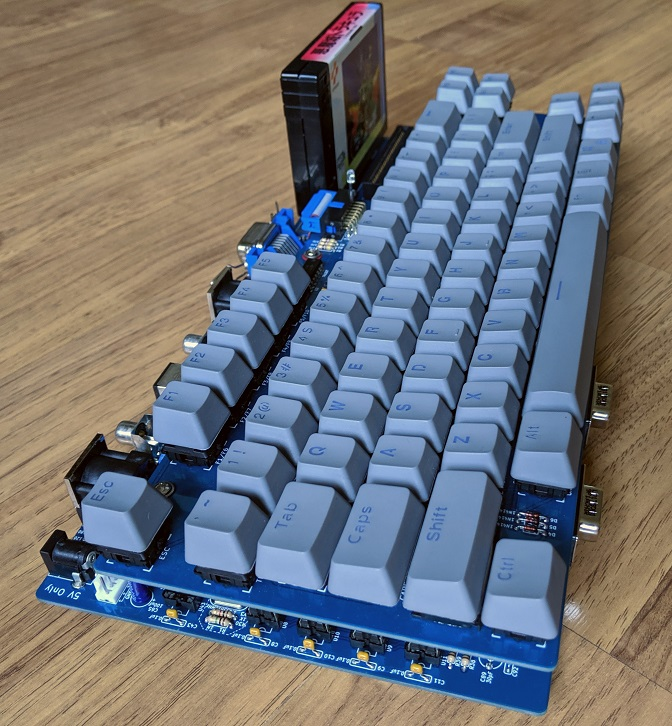

# Omega
Omega Home Computer

[Read this document in English](README.md)

## Introducción
Este proyecto es una implementación open source de un ordenador compatible MSX2. El proyecto se construye usando una combinación de componentes de la era de los 80 - CPU Z80, VDP V9958, PSG AY-3-8910/YM2149F, PPI 8255, 7400-series logic y algunos componentes más recientes tales como el chip de 512 KiB SRAM y 512 KiB Flash ROM además de algunos chips ATF16V88 SPLD (Simple Programable Logic Device).

## Estado
* El sistema completo ha sido probado y funciona correctamente.

## Documentación de las Placas.

[Teclado](Keyboard_es.md)

[Placa Base](Mainboard_es.md)

[Carcasa](Enclosure_es.md)
